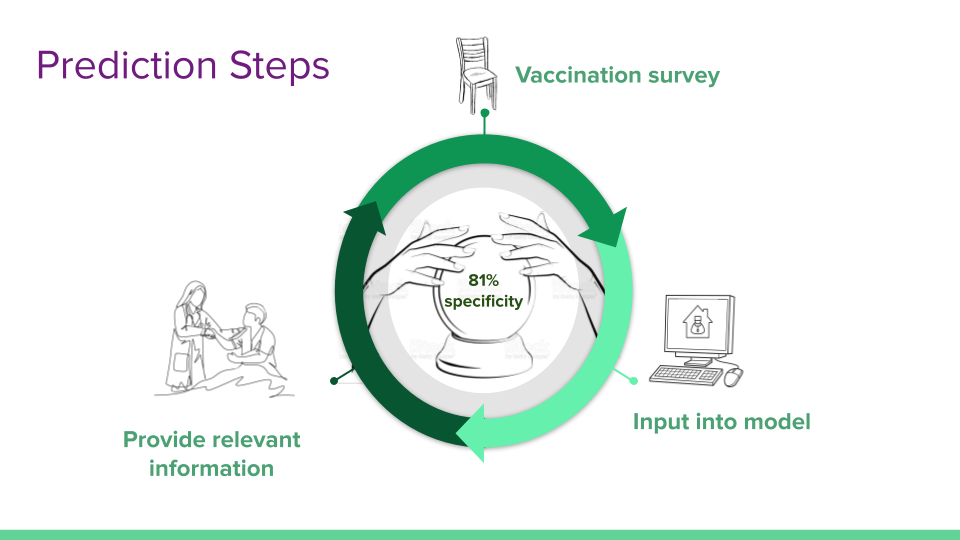
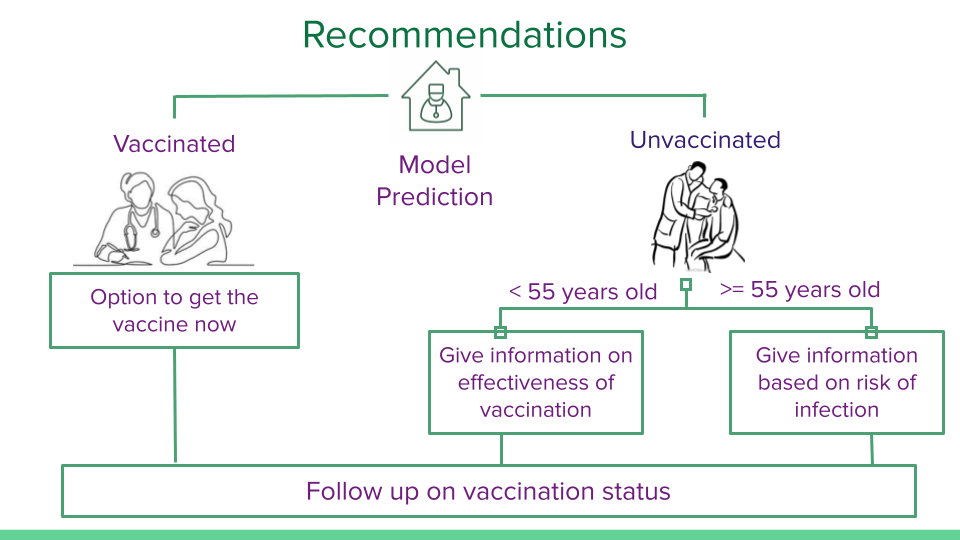

# Vaccine Hesitancy Prediction

##  Overview

Moderna, Inc. is a biotechnology company based in Cambridge, Massachusetts focused on RNA therapeutics such as messenger RNA (mRNA) vaccines. Their use of RNA technology speeds up design and production as compared to traditional vaccines. Moderna’s only current commercial product is Spikevax, a vaccine for SARS-CoV-2, the causative agent of COVID-19. With the success of this Spikevax, Moderna has been developing other RNA-based vaccines for pathogens and diseases such as influenza, HIV, and various cancers. Moderna currently has 44 vaccines and treatments in their production pipeline, of which 22 are in clinical trials. One of these vaccines in Phase 3 trials is a single-shot SARS-CoV-2 and influenza vaccine, called mRNA-1073, to prevent severe reactions and hospitalization to the seasonal influenza virus and COVID-19.

The RNA technology that Moderna is using to create and deliver their vaccines has shown 90+% efficacy but vaccines work only if a person is willing to take it. This repository uses machine learning to identify the most important variables that lead a person to become vaccinated or not. The model will also predict if someone will get a vaccine with 81% specificity.

## Business Problem

Moderna, Inc. is using mRNA science to create a  new generation of transformative medicines for patients. One of these therapies is a vaccine to prevent serious illness from both the seasonal flu and COVID-19. Currently, in Stage 3 trials, this vaccination will reduce the number of vaccinations a person must get to be protected from the seasonal flu and COVID-19 and also increase the efficacy as the current seasonal flu vaccine is between 40-60% effective.

### Stakeholders

For this combined vaccination to be effective, Moderna's executives and pharmaceutical representatives need to understand what variables lead people to become or resist vaccination. The stakeholders of this analysis are Moderna's executives and pharmaceutical representatives that work with doctors and other health care professionals to promote Moderna's vaccines.

## Deliverables

* [Presentation to stakeholders](https://docs.google.com/presentation/d/1t4unzUVCsqnJYtGx6izXjvm-7LawQboYmMtSxp2nzc0/edit?usp=sharing)
* Jupyter Notebook
* GitHub Repository

## Repository Navigation
* [/data](/data) - CDC 2009 National Health Flu Survey
* [/img](/img) - contains image files
* [/disclaimer](/disclaimer) - contains disclaimer information required by the CDC
* [notebook.ipynb](notebook.ipynb) - Jupyter notebook

## Data
The data used for this analysis was the [2009 National Health Flu Survey (NHFS)](https://www.cdc.gov/nchs/nis/data_files_h1n1.htm) conducted by the CDC. This phone survey asked respondents whether they had received the H1N1 influenza and seasonal influenza vaccines and additional questions covering their social, economic, and demographic background, opinions on risks of illness and vaccine effectiveness, and behaviors towards mitigating transmission. This was in reaction to a novel influenza virus, H1N1 or ‘swine flu’, beginning to circulate in the United States. A vaccine for H1N1 was developed and available to the public by the end of 2009. This vaccine was separate from the traditional influenza vaccine because H1N1 emerged too late to be included in the trivalent seasonal influenza vaccine for 2009.

A partially cleaned version of the 2009 NHFS survey was obtained from [Driven Data](https://www.drivendata.org/competitions/66/flu-shot-learning/page/211/#metric). The final cleaned version used for analysis contains 33 variables and 26,707 observations.

### Suitability of Data
While this data is over 10 years old and targets only part of the potential vaccine cocktail Moderna, Inc. will include with their combined seasonal flu and COVID-19 vaccine, this dataset can be used to build a predictive model in line with Moderna’s needs. Moderna Inc. wants to have a predictive model to identify individuals that will or will not be vaccinated against influenza and COVID-19 in a combined vaccine. The last time there was a serious novel respiratory virus pandemic like COVID-19 was in 2009 during the H1N1 pandemic. This time period accurately reflects our current period of having a regular seasonal flu vaccine and a separate novel respiratory virus circulating. After 2009, H1N1 was included in the seasonal influenza vaccine and the population only had to have a single influenza vaccination.

## Modeling

Moderna's business problem is a classification problem and the solution is to be able to take in a series of variables from a patient and predict if this person is going to get a vaccination or not. The classification solution uses machine learning algorithms such as decision trees, random forests, and XGBoost was used to create predictive models and assess the most important variables from this dataset. 

### Model 1: Baseline Decision Tree
A decision tree is a machine learning algorithm is a collection of if-else statements. It was chosen for this analysis because it is powerful, solves classification problems, and is easy to interpret. The training data is partitioned into two or more groups that satisfy a condition. For example, if a respondent has health insurance or not. The variables chosen to split based on a condition is chosen using the amount of information gained in this split.

This model used the default values and the splitting criterion was Gini-index.

As shown under Evaluation, this was the worst performing model in terms of accuracy, precision, recall, and F1-score. To improve the model's predictions the hyperparameters must be tuned to prevent overfitting.

### Model 2: Hyperparameter Tuned Decision Tree
To properly tune the hyperparemeters of this decision tree two steps were done. The first was to use a broad random search of possible hyperparemeters to identify the best. This was then fed into a systematic grid search to narrow down the best possible hyperparameters.

As shown in the Evaluation section, Model 2 performed much better than baseline model 1 but was still only in the 70% range for accuracy, precision, recall, F1, specificity, and Negative Predictive Value (NPV).

### Model 3: Baseline Random Forest
A decision tree will maximize the information gain at every branch. This may lead to overfitting. 

Random Forest is a machine learning algorithm that uses a bagging technique. This bagging technique uses various decision trees on subsets of the dataset. So instead of relying on one decision tree, the model from the Random Forest algorithm finds the prediction from each tree and it predicts the final output based on the majority vote of all the decision trees in the forest. This leads to a reduction of overfitting.

The hyperparameters used were those found during the search in model 2.

As shown in the Evaluation section, there is an increase in all metrics except recall. Most importantly was an increase in specificity which is important for our model as it is more detrimental to predict a false positive (someone who is predicted to get a vaccine but does not) than a false negative (someone that is predicted to not get the vaccine but actually does).

### Model 4: Hyperparameter Tuned Random Forest
The hyperparameters were tuned for the Random Forest algorithm again using a randomized search due to computational complexity. While accuracy and specificity did not increase in comparison to model 3, the metric scores did increase for precision, recall, F1, and NPV.

### Model 5: Hyperparameter Tuned XGBoost
The final algorithm used is Gradient Boosting (XGBoost). In this case, the algorithm uses an ensemble of weak decision trees. It uses gradient descent to minimize the loss function of the model. Once it does, it concentrates on where the model went wrong and creates new learners and continuously improves. XGBoost has been found to outperform Random Forests in  many instances.

The Evaluation section shows that model 5 outperformed model 4 in accuracy, precision, and specificity, but had a lower score in recall, F1, and NPV.

## Evaluation

While many metrics are shown below, the most important metric is specificity. Specificity, also known as the True Negative Value, refers to the probability that a negative prediction is actually negative. In this case it states the probability that a predicted not vaccinated person is actually not vaccinated. Moderna, Inc. wants to vaccinate people against the seasonal flu and COVID-19. If our model predicted a person as having the vaccine when in fact they will not get vaccinated, then this is very harmful to Moderna's needs. People that are accurately predicted to be not vaccinated will be given more information based on the most important variables as indicated in the model. Those that are predicted to be vaccinated would not receive this extra information and the false positive predictions would not have the extra information to become vaccinated.

### Table 1: Metric Scores for the Machine Learning Models

|            Model           	| Accuracy 	| Precision 	| Recall 	| F1-score 	| Specificity 	| NPV   	|
|:--------------------------:	|----------	|-----------	|--------	|----------	|-------------	|-------	|
| M1: Baseline Decision Tree 	| 67.8%    	| 65.3%     	| 66.6%  	| 66.0%      	| 68.8%          	| 70.0%    	|
| M2: Tuned Decision Tree    	| 76.7%    	| 71.8%     	| 70.2%  	| 71.0%    	| 76.9%       	| 75.5% 	|
| M3: Random Forest          	| 76.7%    	| 75.4%     	| 72.5%  	| 73.9%    	| 80.2%       	| 77.7% 	|
| M4: Tuned Random Forest    	| 78.2%    	| 76.3%     	| 75.6%  	| 75.9%    	| 80.4%       	| 79.7% 	|
| M5: Tuned XGBoost          	| 78.5%    	| 76.7%     	| 75.9%  	| 76.3%    	| 80.7%       	| 80.0% 	|

While model 4 and model 5 are very similar in scoring I would choose model 5 (XGBoost) as the best model. It has slightly higher scores in all metrics reported

The top ten important variables as defined by Model 5: XGBoost can be categorized in the following groups:

* opinion of vaccine effectiveness
* Opinion of risk of infection
* Access to healthcare
* Age group

## Conclusion

This analysis shows that it is possible with 79.5% accuracy and 81.5% specificity to predict whether a person will be vaccinated or not. This model can help improve vaccination rates when used in the right settings.

Moderna's pharmaceutical representatives would work in conjunction with their healthcare and government partners to implement this model in healthcare facilities. A patient would take a survey when they visit a healthcare professional. The survey would be inputted into the model and a prediction would be made which is shared with the healthcare professional.

Using the variable importance, relevant information would be provided to the patient based on the vaccination prediction. A person predicted to be vaccinated would be given the option to have get the vaccine and have a follow-up to remind them if necessary. A person predicted to not be vaccinated would be given based on the important variables identified with the model. for people under the age of 55, information would be given to the patient on the effectivness of the vaccine. For those over the age of 55, they would be given information based on the risk of illness of the diseases. With this information the patient can make a more informed decision. A follow-up call would be given to check the patient's vaccination status.

